# 🚀 دليل من الصفر للمبتدئين | Complete Beginner's Guide
## العمل مع Cursor و Claude و GPT-4 في مشاريع AI

> **آخر تحديث**: 2026-01-30  
> **الإصدار**: v1.0  
> **المدة المتوقعة للقراءة**: 45-60 دقيقة  
> **المستوى**: مبتدئ إلى متوسط

---

## 📋 جدول المحتويات | Table of Contents

1. [فهم الصورة الكاملة](#فهم-الصورة-الكاملة)
2. [دورة حياة المشروع - 5 مراحل](#دورة-حياة-المشروع)
3. [خريطة الأدوات وتوقيت الاستخدام](#خريطة-الأدوات)
4. [Prompts جاهزة للنسخ واللصق](#prompts-جاهزة)
5. [سيناريو عملي كامل](#سيناريو-عملي)
6. [الأخطاء الشائعة وحلولها](#الأخطاء-الشائعة)
7. [قائمة المراجعة السريعة](#قائمة-المراجعة)
8. [الموارد والمراجع](#الموارد)

---

## 🎯 فهم الصورة الكاملة

### لماذا هذا الدليل؟

هذا الدليل مصمم لمساعدتك على:
- ✅ **فهم متى تستخدم كل أداة** (Cursor vs Claude vs GPT-4)
- ✅ **تطبيق منهجية عملية** لا تعتمد على العشوائية
- ✅ **استخدام قوالب جاهزة** توفر 70% من وقت التوثيق
- ✅ **تجنب الأخطاء الشائعة** التي تكلف ساعات من إعادة العمل

### الأدوات الثلاث: متى وكيف؟

```
┌─────────────────────────────────────────────────────────────┐
│                     🧠 خريطة الأدوات                        │
├─────────────────────────────────────────────────────────────┤
│                                                             │
│  Claude/GPT-4              Cursor                           │
│  ─────────────            ───────                           │
│  📝 التخطيط                💻 التنفيذ                      │
│  🤔 اتخاذ القرارات         🔨 كتابة الكود                  │
│  📊 توثيق ADR              🐛 تصحيح الأخطاء                │
│  🧪 تصميم الاختبارات       🔄 Refactoring                  │
│  📚 المراجعة والتحسين      ⚡ التطوير السريع               │
│                                                             │
└─────────────────────────────────────────────────────────────┘
```

### القاعدة الذهبية

> **"التفكير في Claude، التنفيذ في Cursor، المراجعة في Claude"**

---

## 🔄 دورة حياة المشروع

### المراحل الخمس الأساسية

```mermaid
graph LR
    A[المرحلة A:<br/>التخطيط الأولي] --> B[المرحلة B:<br/>اتخاذ القرارات]
    B --> C[المرحلة C:<br/>التطوير]
    C --> D[المرحلة D:<br/>الاختبار]
    D --> E[المرحلة E:<br/>الإطلاق والصيانة]
    E -.-> A
```



---

### 📌 المرحلة A: التخطيط الأولي (Planning Phase)

#### 🎯 الهدف
تحويل الفكرة إلى خطة عمل واضحة قابلة للتنفيذ.

#### 🛠️ الأداة المفضلة
**Claude** (للمحادثة التفاعلية وتوضيح المتطلبات)

#### ⏱️ المدة المتوقعة
2-4 ساعات لمشروع متوسط

#### ✅ المخرجات المطلوبة
- [ ] وثيقة متطلبات واضحة
- [ ] قائمة المكونات الرئيسية
- [ ] تحديد التقنيات المحتملة
- [ ] قائمة المخاطر الأولية

#### 📝 سير العمل

```
1. ابدأ محادثة مع Claude
   ↓
2. استخدم Prompt A1 (تحديد الفكرة)
   ↓
3. اطلب تحليل الجدوى Prompt A2
   ↓
4. احفظ النتائج في ملف planning_notes.md
```

---

### 📌 المرحلة B: اتخاذ القرارات (Decision Making)

#### 🎯 الهدف
توثيق القرارات المعمارية والتقنية باستخدام معيار ADR.

#### 🛠️ الأداة المفضلة
**Claude** + **قوالب ADR** من مجلد `standards/adr/`

#### ⏱️ المدة المتوقعة
1-2 ساعة لكل قرار رئيسي

#### ✅ المخرجات المطلوبة
- [ ] ملف ADR واحد على الأقل (0001-framework-choice.md)
- [ ] تحليل Pros & Cons لكل خيار
- [ ] قرار نهائي موثق

#### 📝 سير العمل

```
1. انسخ قالب ADR من standards/adr/0000-template.md
   ↓
2. استخدم Prompt B1 مع Claude
   ↓
3. املأ الأقسام: Context, Decision Drivers, Options
   ↓
4. احفظ في docs/adr/0001-my-decision.md
```

#### 🔗 الربط مع القوالب

```bash
# انسخ القالب
cp standards/adr/0000-template.md docs/adr/0001-framework-choice.md

# املأ المحتوى باستخدام Claude Prompt B1
```

---

### 📌 المرحلة C: التطوير (Development Phase)

#### 🎯 الهدف
تحويل التصميم إلى كود عامل باستخدام Cursor.

#### 🛠️ الأداة المفضلة
**Cursor** (IDE مدعوم بـ AI)

#### ⏱️ المدة المتوقعة
60-80% من وقت المشروع الكلي

#### ✅ المخرجات المطلوبة
- [ ] كود قابل للتشغيل
- [ ] Commit messages واضحة
- [ ] تعليقات توضيحية في الكود المعقد

#### 📝 سير العمل

```
1. افتح Cursor وأنشئ المشروع
   ↓
2. استخدم Prompt C1 (بداية المشروع)
   ↓
3. اطلب من Cursor بناء المكونات بالتدريج
   ↓
4. استخدم Prompt C2 عند مواجهة أخطاء
   ↓
5. استخدم Prompt C3 عند الحاجة لتحسين الكود
```

#### 💡 نصائح Cursor

```
✅ افعل:
- اعمل على feature واحدة في المرة
- اطلب شرح الكود قبل التطبيق
- استخدم Git commits بشكل متكرر

❌ لا تفعل:
- لا تطلب بناء كل شيء دفعة واحدة
- لا تقبل كود لا تفهمه
- لا تتجاهل التحذيرات (warnings)
```

---

### 📌 المرحلة D: الاختبار (Testing Phase)

#### 🎯 الهدف
التأكد من جودة الكود وتغطية الحالات الحرجة.

#### 🛠️ الأداة المفضلة
**Claude** (تصميم خطة الاختبار) + **Cursor** (كتابة الاختبارات)

#### ⏱️ المدة المتوقعة
20-30% من وقت التطوير

#### ✅ المخرجات المطلوبة
- [ ] خطة اختبار من قالب `standards/testing/test-plan-template.md`
- [ ] Unit Tests (اختبارات الوحدات)
- [ ] Integration Tests (اختبارات التكامل)
- [ ] تقرير نتائج الاختبار

#### 📝 سير العمل

```
1. انسخ قالب الاختبار
   cp standards/testing/test-plan-template.md docs/testing/test-plan.md
   ↓
2. استخدم Prompt D1 مع Claude لتصميم الخطة
   ↓
3. افتح Cursor واستخدم Prompt D2 لكتابة الاختبارات
   ↓
4. شغّل الاختبارات وسجل النتائج
```

---

### 📌 المرحلة E: الإطلاق والصيانة (Deployment & Maintenance)

#### 🎯 الهدف
إطلاق آمن مع توثيق للاستجابة للحوادث.

#### 🛠️ الأداة المفضلة
**Claude** (إنشاء Runbook) + **Cursor** (إعداد scripts)

#### ⏱️ المدة المتوقعة
يوم كامل للإعداد، ثم صيانة مستمرة

#### ✅ المخرجات المطلوبة
- [ ] Runbook من قالب `standards/runbooks/incident-response-template.md`
- [ ] خطة نشر (deployment plan)
- [ ] مراقبة (monitoring) نشطة

#### 📝 سير العمل

```
1. انسخ قالب Runbook
   cp standards/runbooks/incident-response-template.md docs/runbooks/production.md
   ↓
2. استخدم Prompt E1 مع Claude
   ↓
3. أضف معلومات الاتصال ومؤشرات المراقبة
   ↓
4. راجع الخطة قبل الإطلاق (Prompt E2)
```

---

## 🧰 خريطة الأدوات

### متى تستخدم Claude/GPT-4؟

| الموقف | الأداة | السبب |
|--------|--------|-------|
| أحتاج تصميم معماري | Claude | تفكير عميق + تحليل شامل |
| أريد مقارنة تقنيات | Claude | قدرة على المقارنة الموضوعية |
| أحتاج كتابة ADR | Claude | جودة عالية في الكتابة التقنية |
| أريد مراجعة كود موجود | Claude | تقييم نقدي وملاحظات مفصلة |
| أحتاج توليد Prompts | Claude/GPT-4 | تخصص في صياغة Prompts |

### متى تستخدم Cursor؟

| الموقف | الأداة | السبب |
|--------|--------|-------|
| بناء feature جديدة | Cursor | سرعة التنفيذ + context من المشروع |
| إصلاح bug | Cursor | فهم سريع للكود الموجود |
| Refactoring | Cursor | تحويلات آمنة + اقتراحات ذكية |
| كتابة unit tests | Cursor | فهم structure الكود |
| Auto-completion | Cursor | دقة عالية في الاقتراحات |

### الجمع بين الأدوات (Hybrid Approach)

```
سيناريو: إضافة Authentication System
────────────────────────────────────────

Step 1: Claude
├─ Prompt: "أريد إضافة نظام مصادقة، ما الخيارات وإيجابيات كل منها؟"
├─ النتيجة: تحليل شامل (JWT vs Session vs OAuth)
└─ الإجراء: اختر JWT مثلاً

Step 2: Claude (ADR)
├─ Prompt: "اكتب ADR لقرار استخدام JWT"
├─ النتيجة: ملف ADR موثق
└─ الإجراء: احفظ في docs/adr/0002-jwt-auth.md

Step 3: Cursor
├─ Prompt: "بناءً على ADR في docs/adr/0002-jwt-auth.md، نفذ JWT authentication"
├─ النتيجة: كود كامل للـ JWT middleware
└─ الإجراء: راجع الكود واختبره

Step 4: Claude (Review)
├─ Prompt: "راجع هذا الكود الخاص بـ JWT [paste code]، هل هناك ثغرات أمنية؟"
├─ النتيجة: ملاحظات أمنية
└─ الإجراء: طبق التحسينات في Cursor
```

---

## 📝 Prompts جاهزة للنسخ واللصق

### 🅰️ المرحلة A: التخطيط الأولي

#### Prompt A1: تحديد الفكرة وتحليلها

```
أريد بناء مشروع [اسم المشروع].

الفكرة الأساسية:
[اكتب فكرتك بجملتين]

المستخدمون المستهدفون:
[من سيستخدم المشروع؟]

المشاكل التي يحلها:
[ما المشكلة الحقيقية؟]

المطلوب منك:
1. تحليل جدوى الفكرة
2. تحديد المكونات الرئيسية (core components)
3. اقتراح stack تقني مناسب
4. تحديد المخاطر المحتملة
5. تقدير الوقت والجهد تقريباً

الرجاء التنظيم في نقاط واضحة وقابلة للتنفيذ.
```

**مثال عملي:**

```
أريد بناء مشروع "وين نروح".

الفكرة الأساسية:
تطبيق يوصي بمطاعم بناءً على الحالة المزاجية والميزانية والموقع الجغرافي.

المستخدمون المستهدفون:
شباب في المدن الكبيرة (20-35 سنة) يحتارون في اختيار مطعم.

المشاكل التي يحلها:
قضاء وقت طويل في البحث عن مطاعم، اتخاذ قرار صعب بسبب كثرة الخيارات.

المطلوب منك:
1. تحليل جدوى الفكرة
2. تحديد المكونات الرئيسية (core components)
3. اقتراح stack تقني مناسب
4. تحديد المخاطر المحتملة
5. تقدير الوقت والجهد تقريباً

الرجاء التنظيم في نقاط واضحة وقابلة للتنفيذ.
```

#### Prompt A2: تفصيل المتطلبات الوظيفية

```
بناءً على التحليل السابق، أريد تفصيل المتطلبات الوظيفية (functional requirements) لمشروع [اسم المشروع].

يرجى تقسيمها إلى:

1. **Must Have** (أساسيات لا يعمل المشروع بدونها)
2. **Should Have** (مهمة لكن ليست critical)
3. **Nice to Have** (إضافات لو يوجد وقت)

لكل متطلب، حدد:
- الوصف بجملة واحدة
- User Story بصيغة: "كمستخدم، أريد أن [فعل] حتى [غاية]"
- Acceptance Criteria (3 نقاط على الأقل)

التنسيق المطلوب:
استخدم Markdown مع checkboxes لسهولة التتبع.
```

---

### 🅱️ المرحلة B: اتخاذ القرارات (ADR)

#### Prompt B1: إنشاء ADR لقرار تقني

```
أريد توثيق قرار تقني باستخدام معيار ADR (Architecture Decision Record).

السياق (Context):
[اشرح الموقف الذي تتخذ فيه القرار]

القرار المطروح:
[ما الذي تريد اتخاذ قرار بشأنه؟ مثلاً: اختيار إطار عمل، قاعدة بيانات، معمارية]

الخيارات المتاحة:
1. [الخيار الأول]
2. [الخيار الثاني]
3. [الخيار الثالث]

المطلوب منك:
1. تحليل Pros & Cons لكل خيار بطريقة موضوعية
2. تحديد Decision Drivers (ما الذي يؤثر على القرار؟)
3. التوصية بقرار نهائي مع التبرير
4. توضيح التبعات (Consequences) الإيجابية والسلبية

استخدم القالب التالي:
[انسخ محتوى standards/adr/0000-template.md هنا أو أشر إليه]
```

**مثال عملي:**

```
أريد توثيق قرار تقني باستخدام معيار ADR.

السياق:
نحتاج لاختيار إطار عمل لتطبيق توصيات المطاعم. التطبيق سيحتوي على واجهة ويب + API.

القرار المطروح:
اختيار Frontend Framework

الخيارات المتاحة:
1. React + Next.js
2. Vue + Nuxt
3. Svelte + SvelteKit

Decision Drivers:
- سرعة التطوير (لدينا شهرين فقط)
- سهولة التعلم (الفريق جديد على Frontend)
- أداء الصفحة (مهم للتجربة)
- دعم SSR (نحتاج SEO جيد)

المطلوب منك:
1. تحليل Pros & Cons لكل خيار
2. تحديد أيها الأنسب لمتطلباتنا
3. كتابة ADR كامل جاهز للحفظ في docs/adr/0001-frontend-framework.md
```

#### Prompt B2: مراجعة ADR موجود

```
لدي ADR موجود، أريد مراجعته للتأكد من جودته.

[الصق محتوى ADR هنا]

المطلوب منك:
1. هل السياق (Context) واضح وكافٍ؟
2. هل Decision Drivers منطقية ومرتبطة بالقرار؟
3. هل تحليل Pros & Cons شامل وموضوعي؟
4. هل القرار النهائي مبرر جيداً؟
5. هل هناك تبعات (Consequences) مفقودة؟

اقترح تحسينات محددة لكل نقطة ضعف.
```

---

### ©️ المرحلة C: التطوير

#### Prompt C1: بداية مشروع جديد في Cursor

```
أريد بدء مشروع [نوع المشروع] باستخدام [التقنيات].

المتطلبات:
- [متطلب 1]
- [متطلب 2]
- [متطلب 3]

الخطوات المطلوبة:
1. إنشاء structure المشروع الأساسي
2. إعداد الـ dependencies الضرورية
3. إنشاء ملف README.md مع تعليمات التشغيل
4. إنشاء environment variables template (.env.example)

ابدأ بـ folder structure وانتظر موافقتي قبل المتابعة.
```

**مثال لـ Next.js:**

```
أريد بدء مشروع Next.js 14 مع TypeScript + Tailwind CSS.

المتطلبات:
- App Router (وليس Pages Router)
- دعم Internationalization (عربي + إنجليزي)
- إعداد ESLint + Prettier
- مجلد components منظم حسب Atomic Design

الخطوات المطلوبة:
1. إنشاء structure المشروع
2. إعداد tsconfig.json
3. إعداد tailwind.config
4. إنشاء README.md

ابدأ بـ folder structure وانتظر موافقتي.
```

#### Prompt C2: إصلاح خطأ في Cursor

```
أواجه الخطأ التالي:

[الصق رسالة الخطأ كاملة]

السياق:
- الملف: [اسم الملف]
- الوظيفة: [ما كنت تحاول فعله]
- الخطوات التي أدت للخطأ: [...]

المطلوب:
1. تفسير سبب الخطأ
2. الحل المقترح مع الكود
3. كيفية تجنب هذا الخطأ مستقبلاً

استخدم comments في الكود لشرح الحل.
```

#### Prompt C3: تحسين وإعادة هيكلة الكود (Refactoring)

```
لدي الكود التالي الذي يعمل، لكن أريد تحسينه:

[الصق الكود هنا]

المشاكل التي ألاحظها:
- [مثلاً: تكرار كود]
- [مثلاً: functions طويلة جداً]
- [مثلاً: صعوبة القراءة]

المطلوب:
1. Refactor الكود مع الحفاظ على الوظيفة نفسها
2. شرح التحسينات التي تم إجراؤها
3. إذا كانت هناك أنماط تصميم (design patterns) مناسبة، اقترحها

معايير الجودة المطلوبة:
- Clean Code principles
- SOLID principles
- Readable variable names
- Proper error handling
```

---

### 🅳 المرحلة D: الاختبار

#### Prompt D1: تصميم خطة اختبار مع Claude

```
أريد تصميم خطة اختبار شاملة لمشروع [اسم المشروع].

نظرة عامة عن المشروع:
[اشرح المشروع بفقرة واحدة]

المكونات الرئيسية:
1. [Component 1]
2. [Component 2]
3. [Component 3]

المطلوب:
1. تحديد أنواع الاختبارات المطلوبة:
   - Unit Tests
   - Integration Tests
   - End-to-End Tests
   - Performance Tests (إذا كان ضرورياً)
   
2. لكل نوع، حدد:
   - الأدوات المناسبة (مثلاً: Jest, Playwright)
   - Test Cases رئيسية (على الأقل 5 لكل نوع)
   - Priority (High/Medium/Low)
   
3. تقدير الوقت المطلوب للتنفيذ

استخدم القالب في standards/testing/test-plan-template.md كأساس.
```

#### Prompt D2: كتابة اختبارات في Cursor

```
أريد كتابة unit tests للـ function/class التالية:

[الصق الكود هنا]

المطلوب:
1. كتابة test suite كامل باستخدام [إطار الاختبار، مثلاً Jest]
2. تغطية الحالات التالية:
   - Happy path (الحالة المثالية)
   - Edge cases (الحالات الحدية)
   - Error cases (حالات الأخطاء)
3. استخدام descriptive test names
4. إضافة comments عند الحاجة

الصيغة المفضلة:
describe('ComponentName', () => {
  it('should do something when condition', () => {
    // Arrange
    // Act
    // Assert
  });
});
```

---

### 🅴 المرحلة E: الإطلاق والصيانة

#### Prompt E1: إنشاء Runbook مع Claude

```
أريد إنشاء Runbook لمشروع [اسم المشروع] استعداداً للإطلاق.

معلومات المشروع:
- البيئة: [مثلاً: AWS, Vercel, Docker]
- الخدمات الرئيسية: [API, Database, Cache, etc.]
- أوقات الذروة المتوقعة: [مثلاً: مساءً 6-10م]

المطلوب:
1. قسم "ماذا تفعل عند حادث" مع سيناريوهات شائعة:
   - Database connection lost
   - High memory usage
   - API slow response
   - Deployment failed
   
2. معلومات الاتصال:
   - قنوات Slack/Discord
   - أرقام الطوارئ
   - Escalation path
   
3. مؤشرات المراقبة (Monitoring):
   - Metrics مهمة
   - حدود التنبيه (Alert thresholds)
   
4. خطوات Rollback سريعة

استخدم القالب في standards/runbooks/incident-response-template.md.
```

#### Prompt E2: مراجعة ما قبل الإطلاق (Pre-launch Review)

```
أنا على وشك إطلاق مشروع [اسم المشروع].

Checklist حالية:
- [x] كود جاهز ومُختبر
- [x] Database migrations جاهزة
- [ ] Monitoring معد
- [ ] Backup strategy موثقة
- [ ] Rollback plan موجود

المطلوب:
1. مراجعة شاملة لـ Pre-launch Checklist
2. تحديد أي نقاط مفقودة
3. ترتيب الأولويات (ما يجب إنجازه قبل الإطلاق vs ما يمكن تأجيله)
4. اقتراح timeline واقعي

الأمور الحرجة التي يجب التأكد منها:
- Security (هل هناك ثغرات واضحة؟)
- Performance (هل تم اختبار الأداء تحت حمل؟)
- Data Integrity (هل هناك خطر فقدان بيانات؟)
```

---

## 🎬 سيناريو عملي كامل

### مشروع: "وين نروح" - تطبيق توصيات المطاعم

#### نظرة عامة

**الفكرة**: تطبيق ويب يوصي بمطاعم بناءً على:
- الحالة المزاجية (Happy, Sad, Stressed, Celebrating)
- الميزانية (Budget: Low/Medium/High)
- الموقع الجغرافي

**المدة المتوقعة**: 6-8 أسابيع

**Stack التقني**:
- Frontend: Next.js 14 + TypeScript + Tailwind
- Backend: Next.js API Routes
- Database: PostgreSQL (Supabase)
- AI: OpenAI GPT-4 للتوصيات

---

### الأسبوع 1: التخطيط + ADR

#### Day 1-2: التخطيط مع Claude

**الخطوة 1**: استخدم Prompt A1

```
أريد بناء مشروع "وين نروح".

الفكرة الأساسية:
تطبيق يوصي بمطاعم بناءً على الحالة المزاجية والميزانية والموقع.

المستخدمون المستهدفون:
شباب في المدن الكبيرة (20-35 سنة).

المشاكل التي يحلها:
قضاء وقت طويل في البحث، اتخاذ قرار صعب بسبب كثرة الخيارات.

المطلوب منك:
1. تحليل جدوى الفكرة
2. تحديد المكونات الرئيسية
3. اقتراح stack تقني
4. تحديد المخاطر
5. تقدير الوقت
```

**النتيجة المتوقعة من Claude**:
- ✅ جدوى: فكرة قابلة للتنفيذ
- ✅ مكونات: User Interface, Recommendation Engine, Restaurant Database, User Preferences
- ✅ Stack: Next.js + PostgreSQL + OpenAI API
- ⚠️ مخاطر: تكلفة OpenAI API, جودة بيانات المطاعم
- ⏱️ تقدير: 6-8 أسابيع

**الخطوة 2**: احفظ النتائج

```bash
mkdir -p docs/planning
# احفظ ردّ Claude في:
docs/planning/initial-analysis.md
```

#### Day 3-4: اتخاذ القرارات (ADR)

**القرار الأول**: اختيار Frontend Framework

استخدم Prompt B1 مع Claude:

```
أريد توثيق قرار Frontend Framework.

السياق:
تطبيق "وين نروح" يحتاج لواجهة سريعة مع دعم SSR للـ SEO.

الخيارات:
1. Next.js + React
2. Nuxt + Vue
3. SvelteKit

Decision Drivers:
- سرعة التطوير
- دعم SEO
- حجم المجتمع
- تكامل مع OpenAI API

[استخدم standards/adr/0000-template.md]
```

**احفظ النتيجة**:

```bash
mkdir -p docs/adr
# احفظ في:
docs/adr/0001-frontend-framework.md
```

**القرار الثاني**: اختيار Database

```
أريد توثيق قرار Database.

السياق:
نحتاج تخزين بيانات المطاعم + تفضيلات المستخدمين + سجل التوصيات.

الخيارات:
1. PostgreSQL (Supabase)
2. MongoDB (Atlas)
3. Firebase Firestore

Decision Drivers:
- سهولة الإعداد
- دعم GeoQueries
- التكلفة
- Real-time capabilities

[استخدم القالب]
```

**احفظ النتيجة**:

```bash
docs/adr/0002-database-choice.md
```

---

### الأسبوع 2-5: التطوير مع Cursor

#### Week 2: إعداد المشروع

**اليوم 1**: إنشاء المشروع

افتح Cursor واستخدم Prompt C1:

```
أريد بدء مشروع Next.js 14 مع TypeScript + Tailwind.

المتطلبات:
- App Router
- دعم Internationalization (عربي + إنجليزي)
- ESLint + Prettier
- مجلد components منظم

الخطوات:
1. إنشاء structure
2. إعداد tsconfig
3. إعداد tailwind.config
4. README.md

ابدأ بـ folder structure.
```

**Structure المتوقع**:

```
where-to-go/
├── app/
│   ├── [lang]/
│   │   ├── page.tsx
│   │   ├── restaurants/
│   │   └── profile/
│   ├── api/
│   │   ├── recommendations/
│   │   └── restaurants/
│   └── layout.tsx
├── components/
│   ├── atoms/
│   ├── molecules/
│   └── organisms/
├── lib/
│   ├── db/
│   ├── ai/
│   └── utils/
├── docs/
│   ├── adr/
│   ├── planning/
│   └── testing/
└── standards/ [القوالب من المجلد الأساسي]
```

**اليوم 2-3**: إعداد Database

في Cursor:

```
استناداً إلى ADR في docs/adr/0002-database-choice.md:

المطلوب:
1. إنشاء Supabase client في lib/db/supabase.ts
2. تعريف types في lib/db/types.ts:
   - Restaurant (id, name, location, cuisine, price_range)
   - UserPreference (user_id, mood, budget)
   - Recommendation (id, restaurant_id, user_id, timestamp)
3. إنشاء migrations في lib/db/migrations/
4. إضافة .env.example مع متغيرات Supabase

ابدأ بالـ types.
```

**اليوم 4-5**: بناء Recommendation Engine

```
أريد بناء recommendation engine في lib/ai/recommender.ts.

المطلوب:
1. Function: generateRecommendation(mood, budget, location)
2. تستخدم OpenAI GPT-4 API
3. تسترجع مطاعم من Database
4. تُرجع أفضل 5 توصيات مع التبرير

استخدم TypeScript مع error handling كامل.
```

#### Week 3-4: بناء UI Components

**المكونات الرئيسية**:

1. **MoodSelector** (اختيار الحالة المزاجية)

```
أريد component في components/organisms/MoodSelector.tsx:

المتطلبات:
- عرض 4 خيارات: Happy, Sad, Stressed, Celebrating
- كل خيار له icon + label
- حفظ الاختيار في state
- دعم i18n (عربي/إنجليزي)

استخدم Tailwind للتصميم.
```

2. **RestaurantCard** (عرض معلومات مطعم)

```
أريد component في components/molecules/RestaurantCard.tsx:

Props:
- restaurant: Restaurant type
- onSelect: () => void

المحتوى:
- صورة المطعم
- الاسم
- نوع المطبخ
- النطاق السعري (icons)
- المسافة
- زر "اختر هذا المطعم"

استخدم Tailwind + shadcn/ui إذا مناسب.
```

3. **RecommendationView** (عرض النتائج)

```
أريد component في components/organisms/RecommendationView.tsx:

المتطلبات:
- استدعاء API /api/recommendations
- عرض loading state
- عرض قائمة RestaurantCard
- عرض سبب التوصية (من GPT-4)
- زر "احصل على توصيات جديدة"
```

#### Week 5: API Routes

**Route 1**: `/api/recommendations`

```
أريد API route في app/api/recommendations/route.ts:

Method: POST
Body: { mood: string, budget: string, location: { lat, lng } }

الخطوات:
1. Validate input
2. استدعاء generateRecommendation()
3. حفظ النتيجة في Database
4. إرجاع JSON مع التوصيات

استخدم Next.js 14 Route Handlers.
```

**Route 2**: `/api/restaurants`

```
أريد API route في app/api/restaurants/route.ts:

Methods: GET, POST

GET: إرجاع كل المطاعم (مع pagination)
POST: إضافة مطعم جديد (admin only)

استخدم Supabase client.
```

---

### الأسبوع 6: الاختبار

#### اليوم 1-2: تصميم خطة الاختبار

استخدم Prompt D1 مع Claude:

```
أريد خطة اختبار لمشروع "وين نروح".

المكونات:
1. MoodSelector component
2. RestaurantCard component
3. Recommendation Engine
4. API routes

المطلوب:
1. Unit Tests (Jest + React Testing Library)
2. Integration Tests (API routes)
3. E2E Tests (Playwright)

حدد Test Cases رئيسية لكل نوع.
```

**احفظ النتيجة**:

```bash
cp standards/testing/test-plan-template.md docs/testing/test-plan.md
# املأ بناتج Claude
```

#### اليوم 3-5: كتابة الاختبارات

**Unit Test لـ MoodSelector**:

في Cursor، استخدم Prompt D2:

```
أريد unit tests لـ MoodSelector component.

[الصق كود Component]

المطلوب:
- اختبار render صحيح لكل الخيارات
- اختبار onClick handler
- اختبار i18n (عربي/إنجليزي)

استخدم Jest + React Testing Library.
```

**Integration Test لـ API**:

```
أريد integration test لـ /api/recommendations.

المطلوب:
- اختبار valid request يرجع 200
- اختبار invalid input يرجع 400
- اختبار حفظ في Database
- mock OpenAI API

استخدم Jest + supertest.
```

**E2E Test**:

```
أريد E2E test باستخدام Playwright:

السيناريو:
1. المستخدم يفتح الصفحة
2. يختار mood = "Happy"
3. يختار budget = "Medium"
4. يسمح بالوصول للموقع
5. يضغط "احصل على توصيات"
6. يرى قائمة مطاعم

اختبر happy path كامل.
```

**تشغيل الاختبارات**:

```bash
npm test                    # Unit + Integration
npm run test:e2e            # E2E
```

---

### الأسبوع 7: التحضير للإطلاق

#### اليوم 1-2: إنشاء Runbook

استخدم Prompt E1 مع Claude:

```
أريد Runbook لـ "وين نروح".

البيئة: Vercel + Supabase

الخدمات:
- Next.js app على Vercel
- PostgreSQL على Supabase
- OpenAI API

أوقات الذروة: مساءً 6-10م

المطلوب:
1. سيناريوهات حوادث شائعة
2. معلومات اتصال
3. مؤشرات مراقبة
4. خطوات Rollback

[استخدم standards/runbooks/incident-response-template.md]
```

**احفظ النتيجة**:

```bash
cp standards/runbooks/incident-response-template.md docs/runbooks/production.md
# املأ بناتج Claude
```

#### اليوم 3: إعداد Monitoring

**في Cursor**:

```
أريد إعداد monitoring:

المطلوب:
1. تكامل مع Vercel Analytics
2. إضافة logging في API routes (استخدم winston أو pino)
3. إعداد error tracking (Sentry)
4. dashboard بسيط لمراقبة:
   - عدد الطلبات
   - متوسط وقت الاستجابة
   - Errors count

ابدأ بـ logger setup.
```

#### اليوم 4-5: Pre-launch Review

استخدم Prompt E2 مع Claude:

```
أنا على وشك إطلاق "وين نروح".

Checklist حالية:
- [x] كود جاهز ومختبر
- [x] Database migrations
- [x] Monitoring معد
- [x] Runbook موجود
- [ ] Load testing
- [ ] Security review
- [ ] Backup strategy

المطلوب:
مراجعة شاملة وترتيب الأولويات.
```

---

### الأسبوع 8: الإطلاق + المتابعة

#### اليوم 1: الإطلاق الناعم (Soft Launch)

```bash
# Deploy على Vercel
git push origin main

# مراقبة Logs
vercel logs --follow

# تحقق من Metrics
# افتح Vercel Dashboard + Sentry
```

#### اليوم 2-5: المتابعة

**مراجعة يومية**:
1. تحقق من Errors في Sentry
2. راجع User feedback
3. راقب API usage (تكلفة OpenAI)
4. حدّث Runbook إذا ظهرت مشاكل جديدة

**إذا حدث incident**:
1. افتح `docs/runbooks/production.md`
2. اتبع الخطوات المحددة
3. سجل Incident في ملف `docs/incidents/YYYY-MM-DD-incident-name.md`

---

## ❌ الأخطاء الشائعة وحلولها

### الخطأ 1: عدم توثيق القرارات

**المشكلة**:
```
"اخترنا Next.js لأنه... أممم... لماذا اخترناه بالضبط؟"
```

**الحل**:
- ✅ دائماً وثّق القرارات المعمارية في ADR
- ✅ حتى القرارات "الصغيرة" مثل اختيار مكتبة
- ✅ راجع ADR بعد 3 أشهر لتقييم القرار

**الأداة**: `standards/adr/0000-template.md`

---

### الخطأ 2: طلب كل شيء دفعة واحدة من Cursor

**المشكلة**:
```
Prompt: "ابني لي تطبيق كامل مع authentication + payments + admin panel"
```

**النتيجة**:
- كود ضخم غير منظم
- bugs كثيرة
- صعوبة في الفهم

**الحل**:
- ✅ اطلب feature واحدة في المرة
- ✅ راجع الكود قبل الانتقال للتالية
- ✅ استخدم Git commits بشكل متكرر

**Prompt الصحيح**:
```
ابدأ بـ authentication system فقط:
1. User registration
2. Login/Logout
3. Session management

استخدم NextAuth.js. ابدأ بالـ setup فقط وانتظر موافقتي.
```

---

### الخطأ 3: عدم الاختبار حتى النهاية

**المشكلة**:
```
"خلصنا التطوير! الآن نبدأ الاختبار..."
[اكتشاف 50 bug]
```

**الحل**:
- ✅ اختبر كل feature بعد بنائها مباشرة
- ✅ اكتب unit tests أثناء التطوير
- ✅ استخدم TDD إذا أمكن

**Workflow الصحيح**:
```
1. بناء feature
2. كتابة tests لها
3. تشغيل tests
4. إصلاح bugs
5. commit
6. الانتقال للـ feature التالية
```

---

### الخطأ 4: تجاهل الـ Edge Cases

**المشكلة**:
```
Function تعمل مع inputs عادية، لكن تقع مع:
- Empty strings
- Null values
- Arrays فارغة
```

**الحل**:
- ✅ دائماً اسأل Cursor عن edge cases
- ✅ اكتب tests لـ edge cases
- ✅ استخدم TypeScript strict mode

**Prompt في Cursor**:
```
راجع هذا الكود وحدد:
1. Edge cases لم يتم التعامل معها
2. Potential runtime errors
3. اقترح validation إضافية

[الصق الكود]
```

---

### الخطأ 5: عدم وجود Runbook قبل الإطلاق

**المشكلة**:
```
[الساعة 2 صباحاً]
"الموقع down! ما نعرف إيش نسوي!"
```

**الحل**:
- ✅ أنشئ Runbook قبل الإطلاق بأسبوع
- ✅ اختبر سيناريوهات الطوارئ
- ✅ شارك Runbook مع كل الفريق

**الأداة**: `standards/runbooks/incident-response-template.md`

---

### الخطأ 6: الاعتماد الكلي على AI دون فهم

**المشكلة**:
```
"Cursor كتب هذا الكود... ما أدري كيف يشتغل لكن يشتغل!"
```

**الخطر**:
- صيانة مستحيلة
- عدم القدرة على debugging
- قد يحتوي على ثغرات أمنية

**الحل**:
- ✅ دائماً اطلب شرح الكود
- ✅ إذا لم تفهم، اطلب تبسيطه
- ✅ راجع الكود في Claude للتقييم

**Prompt للشرح**:
```
اشرح هذا الكود سطراً بسطر كأني مبتدئ:

[الصق الكود]

ركز على:
1. لماذا استخدمت هذا الـ pattern؟
2. ماذا يحدث في كل step؟
3. ما البدائل الأخرى؟
```

---

### الخطأ 7: عدم استخدام Version Control بشكل صحيح

**المشكلة**:
```
Git commit -m "update"
Git commit -m "fix"
Git commit -m "final fix"
Git commit -m "final fix 2"
```

**الحل**:
- ✅ استخدم Conventional Commits
- ✅ Commit بعد كل feature
- ✅ اكتب commit messages واضحة

**الصيغة الصحيحة**:
```bash
git commit -m "feat: add mood selector component"
git commit -m "fix: handle empty restaurant list"
git commit -m "test: add unit tests for MoodSelector"
git commit -m "docs: update ADR for database choice"
```

---

## ✅ قائمة المراجعة السريعة

### قبل بدء المشروع

- [ ] حددت الفكرة بوضوح (استخدمت Prompt A1)
- [ ] كتبت متطلبات وظيفية (Must Have vs Nice to Have)
- [ ] اخترت Stack تقني ووثقت القرار في ADR
- [ ] أنشأت Git repository
- [ ] أعددت folder structure منظم

### أثناء التطوير

- [ ] وثقت كل قرار معماري في ADR
- [ ] عملت على feature واحدة في المرة
- [ ] اختبرت كل feature بعد بنائها
- [ ] كتبت commits واضحة ومتكررة
- [ ] راجعت الكود بشكل دوري مع Claude

### قبل الإطلاق

- [ ] أكملت خطة اختبار شاملة (Unit + Integration + E2E)
- [ ] أنشأت Runbook كامل
- [ ] أعددت monitoring (logs + errors + metrics)
- [ ] اختبرت الأداء تحت حمل (load testing)
- [ ] راجعت الأمان (security review)
- [ ] وثقت API (إذا موجود)
- [ ] أعددت backup strategy

### بعد الإطلاق

- [ ] راقبت metrics يومياً لأول أسبوع
- [ ] سجلت أي incidents في ملفات منفصلة
- [ ] حدثت Runbook بناءً على مشاكل حقيقية
- [ ] جمعت user feedback وحللته
- [ ] خططت للـ features التالية

---

## 📚 الموارد والمراجع

### القوالب في هذا المشروع

| القالب | الموقع | الاستخدام |
|--------|--------|-----------|
| ADR Template | `standards/adr/0000-template.md` | توثيق قرارات معمارية |
| ADR Example | `standards/adr/0001-example.md` | مثال كامل لـ ADR |
| Incident Response | `standards/runbooks/incident-response-template.md` | خطة الاستجابة للحوادث |
| API Failover | `standards/runbooks/api-failover-template.md` | إدارة فشل API |
| System Prompt | `standards/prompts/system-prompt-template.md` | صياغة prompts للـ AI |
| Prompt Library | `standards/prompts/prompt-library-structure.md` | تنظيم مكتبة prompts |
| Test Plan | `standards/testing/test-plan-template.md` | خطة اختبار شاملة |

### مصادر خارجية

#### Architecture Decision Records (ADR)
- [MADR - Official Template](https://github.com/adr/madr) ⭐ القالب المستخدم في المشروع
- [ADR GitHub Organization](https://adr.github.io/)
- [Microsoft: Maintain an ADR](https://learn.microsoft.com/en-us/azure/well-architected/architect-role/architecture-decision-record)

#### Incident Response
- [PagerDuty Incident Response Docs](https://response.pagerduty.com/) ⭐ المصدر الأساسي
- [Google SRE Book](https://sre.google/sre-book/table-of-contents/)
- [Atlassian Incident Management](https://www.atlassian.com/incident-management)

#### Prompt Engineering
- [DAIR.AI Prompt Engineering Guide](https://www.promptingguide.ai/) ⭐ دليل شامل
- [OpenAI Best Practices](https://platform.openai.com/docs/guides/prompt-engineering)
- [Anthropic Prompt Library](https://docs.anthropic.com/claude/prompt-library)

#### Testing
- [Jest Documentation](https://jestjs.io/)
- [Playwright Best Practices](https://playwright.dev/docs/best-practices)
- [Testing Library](https://testing-library.com/)

#### General Best Practices
- [Clean Code by Robert C. Martin](https://www.amazon.com/Clean-Code-Handbook-Software-Craftsmanship/dp/0132350882)
- [The Pragmatic Programmer](https://pragprog.com/titles/tpp20/the-pragmatic-programmer-20th-anniversary-edition/)
- [Google Engineering Practices](https://google.github.io/eng-practices/)

---

## 🎓 خطوات التعلم المقترحة

### المستوى 1: المبتدئ (أسبوعين)

**الأهداف**:
- فهم متى تستخدم Claude vs Cursor
- إنشاء ADR أول
- بناء مشروع بسيط بمساعدة AI

**المشاريع المقترحة**:
1. **To-Do List App**
   - تطبيق بسيط لإدارة المهام
   - استخدم Next.js + localStorage
   - وثّق قرار اختيار Framework في ADR

2. **Weather Dashboard**
   - عرض حالة الطقس من API عام
   - استخدم React + Tailwind
   - اكتب unit tests بسيطة

**التقييم**:
- [ ] أنشأت ADR واحد على الأقل
- [ ] استخدمت Cursor لبناء المشروع
- [ ] كتبت 5 unit tests على الأقل

---

### المستوى 2: المتوسط (شهر)

**الأهداف**:
- بناء مشروع متكامل مع database
- تطبيق testing strategy كاملة
- إنشاء Runbook

**المشاريع المقترحة**:
1. **Personal Finance Tracker**
   - تتبع المصروفات والدخل
   - استخدم Next.js + Supabase
   - أضف charts للتحليل

2. **Recipe Sharing Platform**
   - مشاركة وتقييم وصفات الطبخ
   - authentication + user profiles
   - search & filter

**التقييم**:
- [ ] وثقت 3+ قرارات في ADR
- [ ] كتبت test plan كامل
- [ ] أنشأت Runbook جاهز للإنتاج
- [ ] نشرت المشروع على Vercel/Netlify

---

### المستوى 3: المتقدم (شهرين)

**الأهداف**:
- بناء تطبيق production-ready
- تطبيق CI/CD
- مراقبة وصيانة مستمرة

**المشاريع المقترحة**:
1. **SaaS Platform (مبسط)**
   - مثل أداة لإدارة المشاريع
   - authentication + subscriptions
   - admin panel

2. **AI-Powered App**
   - مثل chatbot أو أداة content generation
   - تكامل مع OpenAI/Anthropic API
   - rate limiting + caching

**التقييم**:
- [ ] مشروع كامل مع 10+ ADRs
- [ ] تغطية اختبارات >80%
- [ ] Monitoring نشط (Sentry + Analytics)
- [ ] handling real incidents باستخدام Runbook

---

## 🔧 أدوات مساعدة إضافية

### إدارة المشروع

| الأداة | الوصف | متى تستخدمها |
|-------|--------|---------------|
| [Linear](https://linear.app/) | إدارة المهام والـ issues | مشاريع فرق صغيرة |
| [Notion](https://notion.so/) | توثيق وتنظيم | مركزية الوثائق |
| [Excalidraw](https://excalidraw.com/) | رسم مخططات | تصميم معماريات |

### مراقبة وتحليل

| الأداة | الوصف | متى تستخدمها |
|-------|--------|---------------|
| [Sentry](https://sentry.io/) | تتبع الأخطاء | كل مشروع production |
| [Vercel Analytics](https://vercel.com/analytics) | Web analytics | مشاريع Next.js |
| [Uptime Robot](https://uptimerobot.com/) | مراقبة uptime | مجاني لـ 50 monitor |

### Prompt Management

| الأداة | الوصف | متى تستخدمها |
|-------|--------|---------------|
| [PromptFoo](https://www.promptfoo.dev/) | اختبار وتقييم prompts | عند بناء AI features |
| [LangSmith](https://smith.langchain.com/) | debugging لـ LLM chains | تطبيقات LangChain |

---

## 💬 الأسئلة الشائعة (FAQ)

### س1: هل يجب استخدام كل القوالب في كل مشروع؟

**ج**: لا، اختر حسب حجم المشروع:
- **مشروع صغير** (أسبوعين): ADR اختياري، لا حاجة لـ Runbook
- **مشروع متوسط** (شهر-شهرين): ADR + Test Plan
- **مشروع كبير** (3+ أشهر): كل القوالب

---

### س2: متى أستخدم Claude ومتى GPT-4؟

**ج**: كلاهما ممتاز، لكن:
- **Claude**: أفضل في الكتابة الطويلة (ADR, documentation)
- **GPT-4**: أسرع في الأجوبة القصيرة

يمكنك استخدام أي منهما في أي مرحلة.

---

### س3: Cursor مكلف، هل يوجد بدائل؟

**ج**: نعم:
- **VS Code + GitHub Copilot**: أرخص لكن أقل ذكاءً في context
- **Cursor Trial**: 14 يوم مجاناً لتجربة
- **Claude في Terminal**: مجاني لكن بدون IDE features

---

### س4: كم ADR أحتاج في مشروع واحد؟

**ج**: يعتمد على حجم المشروع:
- مشروع صغير: 1-3 ADRs (framework, database, deployment)
- مشروع متوسط: 5-10 ADRs
- مشروع كبير: 20+ ADRs

**القاعدة**: أي قرار يؤثر على المعمارية = ADR

---

### س5: هل الاختبار ضروري حقاً؟

**ج**: **نعم!** خصوصاً:
- Unit tests: لـ business logic
- Integration tests: لـ API routes
- E2E tests: للـ user journeys الحرجة

تخطي الاختبار = مشاكل في production 100%

---

### س6: ماذا لو لم أفهم كود Cursor؟

**ج**: **لا تقبله!**

الخطوات:
1. اطلب من Cursor شرح الكود
2. إذا لم تفهم، اطلب تبسيطه
3. الصق الكود في Claude للمراجعة
4. إذا مازلت لا تفهم، اطلب implementation مختلف

**قاعدة ذهبية**: لا تكتب كود لا تفهمه.

---

### س7: كيف أحافظ على تنظيم الـ Prompts؟

**ج**: استخدم القالب `standards/prompts/prompt-library-structure.md`:

```
prompts/
├── planning/
│   ├── A1-initial-idea.md
│   ├── A2-requirements.md
├── development/
│   ├── C1-new-project.md
│   ├── C2-fix-bug.md
└── testing/
    ├── D1-test-plan.md
    ├── D2-write-tests.md
```

---

## 🚀 الخطوات التالية

### بعد قراءة هذا الدليل

1. **اختر مشروع صغير** من قائمة المشاريع المقترحة
2. **ابدأ بالتخطيط** باستخدام Prompt A1 في Claude
3. **وثّق أول ADR** باستخدام القالب
4. **بني في Cursor** feature بـ feature
5. **اختبر كل شيء** قبل الإطلاق
6. **أنشئ Runbook** وأطلق!

---

### انضم للمجتمع

- **GitHub Discussions**: شارك تجربتك واطرح أسئلة
- **Discord/Slack**: ابحث عن مجموعات AI-assisted development
- **Twitter/X**: تابع #BuildInPublic #AIDevTools

---

## 📄 الترخيص والمساهمة

### الترخيص
هذا الدليل والقوالب المرفقة مرخصة تحت **MIT License**.
يمكنك استخدامها، تعديلها، ومشاركتها بحرية.

### المساهمة
نرحب بالمساهمات! إذا وجدت:
- أخطاء في الدليل
- Prompts يمكن تحسينها
- أمثلة إضافية مفيدة

افتح Pull Request أو Issue.

---

## 🎉 خاتمة

تذكر:
- **AI أداة**، وليس بديل عن التفكير
- **التوثيق يوفر الوقت** على المدى الطويل
- **الاختبار ليس ترف**، بل ضرورة
- **التعلم مستمر**، لا تخف من الأخطاء

**بالتوفيق في مشروعك القادم! 🚀**

---

**آخر تحديث**: 2026-01-30  
**الإصدار**: v1.0.0  
**المؤلف**: بناءً على أفضل الممارسات من MADR, PagerDuty, DAIR.AI

**روابط سريعة**:
- [MADR Template](https://github.com/adr/madr)
- [PagerDuty Docs](https://response.pagerduty.com/)
- [Prompt Engineering Guide](https://www.promptingguide.ai/)

---

## 📞 تواصل معنا

هل لديك اقتراحات؟ أسئلة؟ ملاحظات؟  
افتح Issue في الـ repository أو راسلنا.

**Happy Coding! 💻✨**
